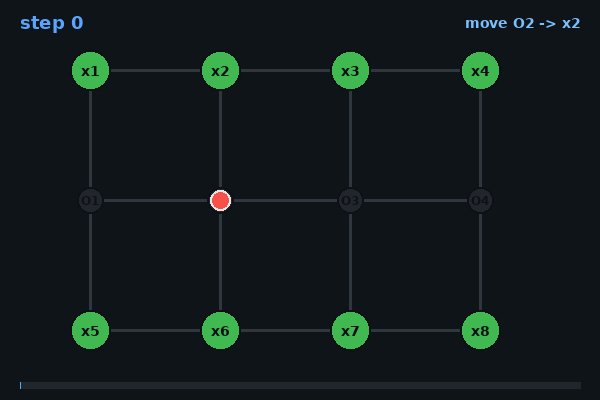
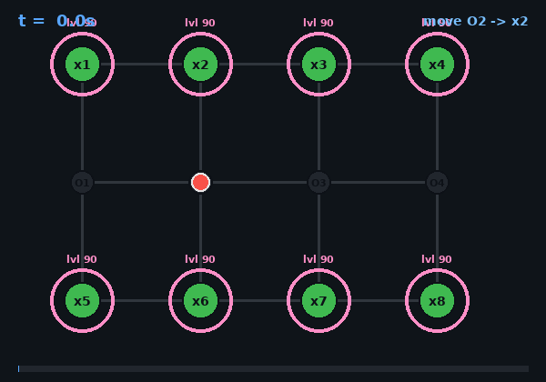
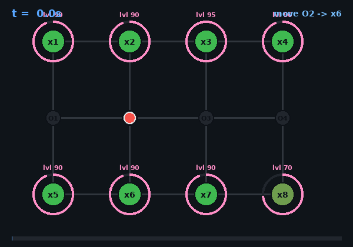

# 🌱 Agricultural Robotics — Crop Monitoring (D5-V1)

A PDDL / PDDL+ planning project for **Artificial Intelligence for Robotics II**.
A mobile robot navigates a field of crop plots, inspects each plot's condition,
and reports its observations. The project is solved in two stages:

- **Q1 — Classical PDDL** (no time): efficient monitoring as a routing problem.
- **Q2 — PDDL+** (continuous time): monitoring as a *race* against crops that
  degrade autonomously over time.

---

## 1. Project Overview

### What this project is about
A single robot must **monitor every plot** in an agricultural field. Monitoring
has two parts:

1. **Inspect** a plot — the robot reads the crop's condition (it must be at the plot).
2. **Report** the observation — logged once the plot has been inspected.

The field is modelled as a **graph**: crop plots (`x1…x8`) are connected through
intermediate **junction** nodes (`O1…O4`) that the robot can travel through but
does not inspect. The robot starts at junction **`O2`** and moves edge-by-edge.

### The main idea and objective
The project models one consistent scenario at two levels of expressiveness:

| Stage | Formalism | Core challenge |
|-------|-----------|----------------|
| **Q1** | Classical PDDL + numeric cost | Visit and report all plots with the **fewest moves** |
| **Q2** | PDDL+ (processes + events) | Inspect every plot **before its crop degrades to failure** |

The key conceptual jump from Q1 to Q2 is **time**: in Q1 the world is static and
only changes when the robot acts; in Q2 the crops degrade *on their own*, so
"doing nothing" has a cost and the **timing** of actions determines success.

---

## 2. Visual Illustration

### Field layout (graph)

```
        x1 ── x2 ── x3 ── x4        ← top row of plots
        │     │     │     │
        O1 ── O2 ── O3 ── O4        ← junction row (routing only)
        │     │     │     │
        x5 ── x6 ── x7 ── x8        ← bottom row of plots
```

- **`x1…x8`** — crop plots to be inspected and reported.
- **`O1…O4`** — junctions: the robot can pass through them but they are *not* monitored.
- The robot starts at junction **`O2`**.

---

## 3. PDDL Model Explanation

### 3.1 Common structure (both Q1 and Q2)

**Types**
- `node` — anything the robot can stand on, split into:
  - `plot` — inspectable crop locations
  - `junction` — routing-only nodes
- `robot` — the monitoring agent
- `condition` — symbolic crop state (`good` / `normal` / `critical`)

**Core predicates**
- `(robot-at ?r ?n)` — robot position
- `(connected ?n1 ?n2)` — graph edges (declared in the problem file)
- `(crop-condition ?p ?c)` — explicit symbolic crop state
- `(inspected ?p)` — the robot has observed this plot
- `(reported ?p)` — the observation has been logged

**Modelling choices and their logic**
- **Plots vs. junctions are separate types** so that `move` can traverse any node,
  but only `plot`s can be inspected. This avoids duplicating actions and keeps the
  graph clean.
- **Crop state is represented explicitly** as `(crop-condition ?p ?c)`, not hidden
  inside a number, so the crop's status is a first-class fact in the model.
- **Inspection is passive** — it only sets `(inspected ?p)` and never changes the
  crop. Monitoring observes; it does not intervene.
- **Reporting is decoupled from position** — `report` only requires that the plot
  was inspected, not that the robot is currently there (the robot can log a reading
  from anywhere).

---

### 3.2 Q1 — Classical PDDL (`domain1.pddl`)

Classical PDDL has **no notion of time**: the world only changes through actions,
and crop conditions are **static**.

**Actions**
| Action | Precondition | Effect |
|--------|--------------|--------|
| `move ?r ?from ?to` | robot at `?from`, edge connected | robot moves; `total-cost += 1` |
| `inspect ?r ?p` | robot at `?p`, not inspected | `(inspected ?p)` |
| `report ?r ?p` | `?p` inspected, not reported | `(reported ?p)` |

**Cost model**
- A single numeric fluent `(total-cost)` increases **only on `move`**.
- This makes the planning objective a **routing problem**: visit and report all
  plots while moving as little as possible.

**The two problem instances**

- **Problem 1 (`problem1_1.pddl`) — stable crops, no optimization.**
  *Input state:* all eight plots are `good`; robot starts at `O2`; **no metric**.
  Any valid plan that reports every plot is accepted. This proves the model is
  correct in the simplest case.

- **Problem 2 (`problem1_2.pddl`) — cost-optimized monitoring.**
  *Input state:* same field and goal, but with `(:metric minimize (total-cost))`.
  Because some crops are higher-priority (more critical), the robot should finish
  the whole monitoring sweep **as soon as possible** — i.e. *monitoring frequency
  matters*: a shorter tour means each plot is revisited sooner in a repeated cycle.
  Run with an **optimal** planner, this yields the **fewest-moves** tour, showing the
  model has real planning depth: the route, not just the action set, matters.

**Goal (both):** every plot reported — `(reported x1) … (reported x8)`.

> **Note — a strategy that did not work.**
> An earlier idea was to make the robot visit the **critical plots first** by using a
> *variable* move cost instead of a flat `+1`. The plan was: give each plot a priority
> weight, start a counter at the **sum of all priorities**, and have every `move`
> add the *current* counter to `total-cost` while each report *decreased* the counter
> by the reported crop's priority — so leaving a high-priority crop unreported would
> keep charging more per move, pushing the planner to handle critical plots early.
> In practice **ENHSP could not optimize this cost.** ENHSP's optimal search only
> reasons about **uniform (unit) action costs** — it effectively ignores a per-action
> cost that varies with the state — so it could not minimize this state-dependent
> objective. We therefore kept the simple, uniform `+1`-per-move cost, which ENHSP
> optimizes correctly.

---

### 3.3 Q2 — PDDL+ (`domain2.pddl`)

PDDL+ adds **continuous time** through `:process` and `:event`. Crops now degrade
**autonomously**, independent of the robot.

**Numeric fluents**
- `(condition-level ?p)` — the crop's health, decreasing over time
- `(degrade-rate ?p)` — how fast each plot degrades
- `(move-timer ?r)` / `(report-timer ?r)` — drive action durations

**Processes** *(continuous change that runs on its own)*

| Process | Runs while | Effect |
|---------|-----------|--------|
| `degrade ?p` | `condition-level > 0` | `condition-level` drops at `degrade-rate` (`* #t rate`) |
| `moving ?r` | robot is moving | `move-timer` counts up |
| `reporting ?r` | robot is reporting | `report-timer` counts up |

The `degrade` process is the heart of Q2: the crop loses health smoothly over time
whether or not the robot is present.

**Events** *(automatic, threshold-triggered state changes)*

| Event | Fires when | Effect |
|-------|-----------|--------|
| `crop-fails ?p` | `condition-level ≤ 20` **and** plot not reported | `(failed ?p)` — permanent; the plot can no longer be reported |
| `move-complete ?r` | `move-timer ≥ 1` | robot arrives at destination; timer reset |
| `report-complete ?r` | `report-timer ≥ 0.2` | `(reported ?p)`; timer reset |

The `crop-fails` event is the failure condition: if a crop crosses the threshold
**before it has been reported**, it fails permanently and the goal becomes
unreachable.

**Time via processes, not durative actions.**
ENHSP does **not** support `:durative-action`. So action durations are modelled with
**timers + processes**: a `start-move` action sets the robot moving, the `moving`
process advances `move-timer`, and the `move-complete` event fires at `timer ≥ 1`
(a 1-second move). The same pattern gives `report` its 0.2-second duration.

**The two problem instances**

- **Problem 1 (`problem2_1.pddl`) — timing irrelevant.**
  *Input state:* all plots start at `condition-level 90` with a slow `degrade-rate 2`.
  The robot finishes long before any crop is at risk, so any order works. Confirms
  the PDDL+ model works in the non-urgent case.

- **Problem 2 (`problem2_2.pddl`) — timing critical.**
  *Input state:* mixed degradation — `x3` starts at `95` with rate `10` and `x8` at
  `70` with rate `10` (both **critical**), while the rest start at `90` with rates
  `2–5`. The fast-degrading plots force the robot to **prioritize** them and reach
  them before the `crop-fails` event triggers. Here the *schedule* of inspections —
  not just their existence — determines feasibility.

**Goal (both):** every plot inspected and reported, with no plot failing first.

---

## 4. How to Run the Project

### 4.1 Install Java 17+
ENHSP runs on Java 17 or higher (Java 21 also works fine).
```bash
sudo apt install openjdk-17-jdk
sudo update-alternatives --config java
java -version            # should report 17 or higher
```

### 4.2 Build the ENHSP planner
```bash
mkdir ~/enhsp
cd ~/enhsp
git clone https://gitlab.com/enricos83/ENHSP-Public.git
cd ENHSP-Public
git checkout enhsp-20
sudo apt install ant
./compile
```
Quick test that the build succeeded:
```bash
java -jar ~/enhsp/ENHSP-Public/enhsp-dist/enhsp.jar
```

> ⚠️ **Do not use the online solver** at `solver.planning.domains` — its ENHSP
> instance is broken (missing a core Java library) and silently returns empty plans.
> Always run the **locally built** jar.

### 4.3 Run the plans (terminal)

**Q1 — Problem 1** (stable crops, any valid plan → satisficing planner):
```bash
java -jar ~/enhsp/ENHSP-Public/enhsp-dist/enhsp.jar \
  -o domain1.pddl -f problem1_1.pddl -planner sat-hmrp
```

**Q1 — Problem 2** (cost-optimized, fewest moves → optimal planner):
```bash
java -jar ~/enhsp/ENHSP-Public/enhsp-dist/enhsp.jar \
  -o domain1.pddl -f problem1_2.pddl -planner opt-hrmax
```

**Q2 — Problem 1** (PDDL+ with time; needs small time deltas):
```bash
java -jar ~/enhsp/ENHSP-Public/enhsp-dist/enhsp.jar \
  -o domain2.pddl -f problem2_1.pddl -planner sat-hadd -dp 0.1 -de 0.1
```

**Q2 — Problem 2** (PDDL+, timing-critical):
```bash
java -jar ~/enhsp/ENHSP-Public/enhsp-dist/enhsp.jar \
  -o domain2.pddl -f problem2_2.pddl -planner sat-hadd -dp 0.1 -de 0.1
```

**Planner / flag notes**
- `sat-*` (e.g. `sat-hmrp`, `sat-hadd`) = **satisficing** — finds *a* valid plan fast,
  ignores cost metrics.
- `opt-hrmax` = **optimal** — respects `(:metric minimize (total-cost))`; used for Q1
  Problem 2 to get the cheapest (fewest-move) plan.
- `-dp 0.1 -de 0.1` set the planning and execution **time deltas** to 0.1 — needed in
  Q2 so the planner steps finely enough to hit the process/event time thresholds.

---

## 5. Results & Outputs

The animations below show each plan executing on the field graph.

**How to read the animations**
- The **red dot** is the robot moving along the graph edges.
- A **blue inner ring** appears on a plot once it is **inspected**.
- A **purple outer ring** (with a `rep` label) appears once it is **reported**.
- In **Q2 only**, a **pink condition ring** around each plot shrinks over time to
  show the crop's `condition-level` dropping; critical plots turn red as they near
  failure.

---

### Q1 — Problem 1 (stable crops)

The planner returns a valid plan that inspects and reports all eight plots. Because
no metric is set, the route is not necessarily minimal — this run confirms the model
is solvable and correct.



---

### Q1 — Problem 2 (cost-optimized)

With `opt-hrmax` and `(:metric minimize (total-cost))`, the planner returns the
**fewest-moves** monitoring tour. Reports — which are free and position-independent —
are scheduled opportunistically, so the optimizer only has to minimize the travel
needed to inspect every plot. Comparing the move count against Problem 1 shows the
benefit of optimization.


---

### Q2 — Problem 1 (timing irrelevant)

All crops degrade slowly, so the robot inspects and reports everything well within
the safe window — the **condition rings** deplete only gently and no plot is ever at
risk. The plan succeeds regardless of visiting order, confirming the PDDL+ model
works in the non-urgent case.



---

### Q2 — Problem 2 (timing critical)

The fast-degrading critical plots (`x3`, `x8`) force the robot to **race**: their
**condition rings** drain quickly and turn red, and the robot must reach and inspect
them just before the `crop-fails` event would trigger. If it delayed, a crop would
cross the failure threshold and the goal would become unreachable. This demonstrates
the central PDDL+ lesson — **inactivity has a cost, and the timing of actions decides
feasibility.**



---

## 6. Project Structure

```
.
├── q1                     # Q1 folder 
  ├── domain1.pddl         # Q1 domain timing irrelevant 
  ├── problem1_1.pddl  
  ├── problem1_2.pddl
├── q2                     # Q2 folder 
  ├── domain1.pddl         # Q2 domain timing dependent
  ├── problem2_1.pddl  
  ├── problem2_2.pddl

└── README.md
```

---

## 7. Running inside VS Code (optional)

You can also run the planner from the **PDDL extension** (Jan Dolejsi). Add the
following to your VS Code `settings.json` so the extension calls the **local** ENHSP
through a small wrapper script (`run_planner.sh`):

```jsonc
{
    "pddlParser.executableOrService": "/home/obai/.config/Code/User/globalStorage/jan-dolejsi.pddl/val/Val-20210401.1-Linux/bin/Parser",
    "pddl.validatorPath": "/home/obai/.config/Code/User/globalStorage/jan-dolejsi.pddl/val/Val-20210401.1-Linux/bin/Validate",
    "pddl.valueSeqPath": "/home/obai/.config/Code/User/globalStorage/jan-dolejsi.pddl/val/Val-20210401.1-Linux/bin/ValueSeq",
    "pddl.valStepPath": "/home/obai/.config/Code/User/globalStorage/jan-dolejsi.pddl/val/Val-20210401.1-Linux/bin/ValStep",
    "pddl.selectedPlanner": "Local ENHSP",
    "pddl.planners": [
        {
            "kind": "COMMAND",
            "path": "bash",
            "syntax": "/home/obai/run_planner.sh $(domain) $(problem)",
            "title": "Local ENHSP",
            "canConfigure": false
        }
    ]
}
```

Here `run_planner.sh` is a small wrapper that invokes the local ENHSP jar with the
chosen planner flags. Open a problem file and use **"PDDL: Run the planner"**.

> ℹ️ The VS Code extension produces the **same plan output** as the terminal, just
> shown in its own panel. The **terminal is recommended**, since the in-editor
> result is essentially the same plain-text plan.

---

## 8. Summary

This project models a single agricultural-monitoring scenario at two levels of the
PDDL spectrum. **Q1** treats it as a classical routing problem where efficiency (move
count) is optimized. **Q2** introduces continuous time: crops degrade on their own via
a **process**, fail via an **event**, and the robot must schedule its inspections to
beat the clock. Together they illustrate the progression from **discrete, static
planning** to **continuous, time-critical hybrid planning** — and why the right level
of abstraction depends on the problem.
